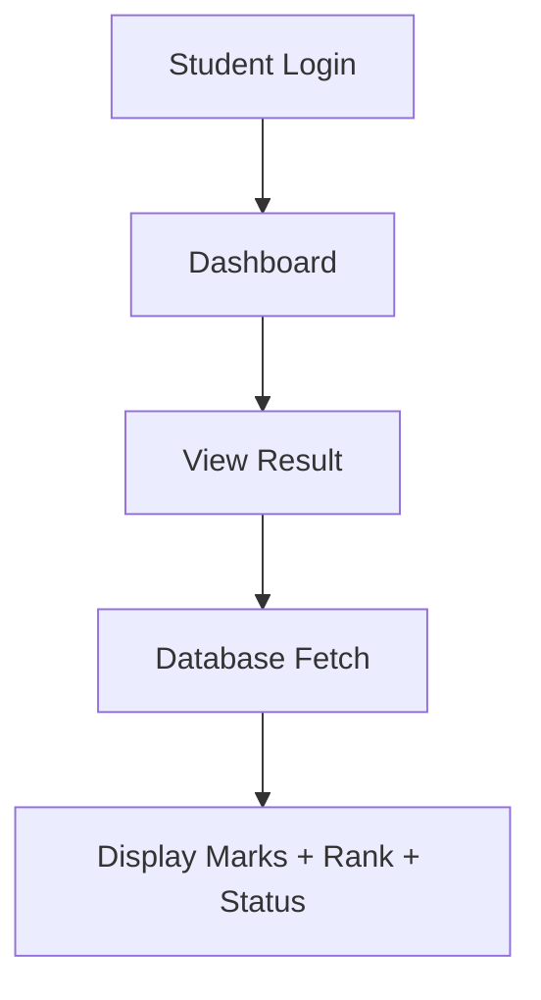
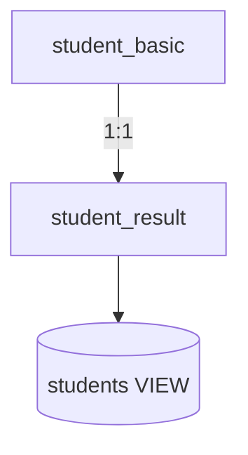

<!-- ================= HERO ================= -->
<h1 align="center">🎓 ONLINE RESULT CHECKING SYSTEM</h1>

<p align="center">


</p>
<p align="center">
A simple and secure result checking system.<br>
Students can view results using Roll Number & DOB.
</p>

---

<!-- COOL STRIP -->
<p align="center">
🔥 Secure Login &nbsp; | &nbsp; ⚡ Fast &nbsp; | &nbsp; 🎯 Clean UI &nbsp; | &nbsp; 💾 Reliable DB
</p>


## 🌟 FEATURES
- 🔐 Secure login (Roll No + DOB)
- 🧑‍🎓 Personal student dashboard
- 📊 Detailed results with Percentile, AIR & Rank
- 📝 Syllabus + Instructions page
- ⚙️ 2 Tables + 1 SQL View
- 🧩 Clean database structure

---

---

## 🛠 TECH STACK

<p align="center">

</p>

| Layer | Technology |
|------|------------|
| 🎨 Frontend | HTML • CSS • JS |
| ⚙️ Backend | PHP |
| 🗄 Database | MySQL + phpMyAdmin |
| 🌍 Server | XAMPP (Apache + MySQL) |

---

## 📊 SYSTEM FLOW (GRAPH)


🗂 DATABASE DESIGN ------------------------------------------------------------------------------------------------------------------------------


## ⚡ QUICK SETUP

1. Copy → `C:\xampp\htdocs\result_project`
2. Start **Apache + MySQL**
3. Create DB & Import  
   - student_basic  
   - student_result  
   - students (VIEW)
4. Open → `http://localhost/result_project/`

## 📁 PROJECT STRUCTURE
```
result_project/
 ├─ login.php
 ├─ dashboard.php
 ├─ view_result.php
 ├─ result_page.php
 ├─ instructions.html
 ├─ syllabus.html
 ├─ db_connect.php
 ├─ style.css
 └─ README.md
```

## 🎯 FUTURE UPDATES
- ⭐ Admin panel
- ⭐ PDF scorecard
- ⭐ Subject marks
- ⭐ Merit list
- ⭐ Better UI

<div align="center">


</div>

## 🔐 SECURITY
- ✔ Session authentication
- ✔ Structured queries
- ✔ Safe data access

<!-- FOOTER --> <p align="center"> ✨ Simple • Secure • Reliable ✨<br> Made for Students | Built with ❤️ </p>
